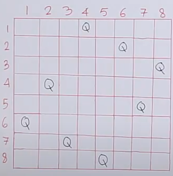

# Alx Interview Prep

## 0x05. N Queens

### Description

The “0x05. N queens” project is a classic problem in computer science and mathematics, known for its application of the backtracking algorithm to place N non-attacking queens on an N×N chessboard. To successfully complete this project, you will need to understand several key concepts and have access to resources that will help you grasp the necessary algorithms and techniques.

### Concepts

The N queens interview problem.

Challenge: Place N queens on an NxN chessboard so that no two queens
attack each other.
Two queens can attack each other if they are on the same row, column,
or diagonal.

The solution is a recursive backtracking algorithm that places queens
on the board one by one.
If the current queen can't be placed, the algorithm backtracks to the
previous queen and tries a different position.

Looking at above diagram, we can say that the queens represented by letter Q
won't be able to attack each other both horizontally and vertically, and diagonally.

- Check out below video to understand the problem indepth.

### Requirements

- Allowed editors: `vi`, `vim`, `emacs`
All your files will be interpreted/compiled on Ubuntu 20.04 LTS using `python3` (version 3.4.3)
All your files should end with a new line
The first line of all your files should be exactly `#!/usr/bin/python3`
A `README.md` file, at the root of the folder of the project, is mandatory
Your code should use the `PEP 8` style (version 1.7.*)
All your files must be executable
